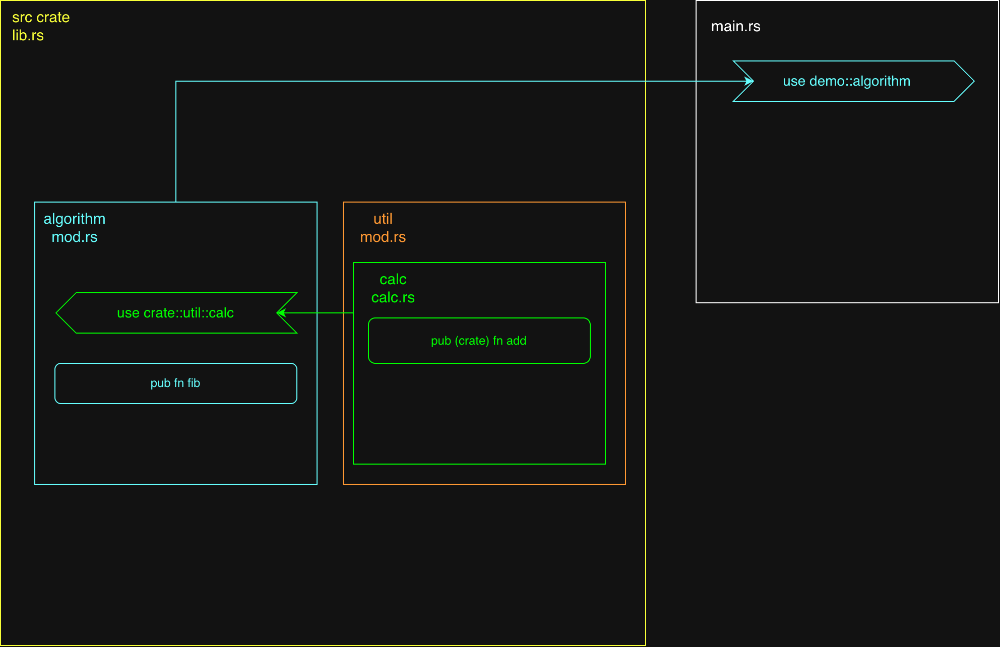

# JSer 入侵 Rust
# 第 2 集 模块化

## 为什么先讲模块化

1. 从大局观来讲，了解一个项目，最先了解它的 代码组织。模块化 是 代码组织 的具体实现。
2. 相较于 JS ESM 所见即所得的模块化，Rust 的模块化有精心的设计以及默认的约定，这些需要 攻城🦁 们掌握。

## 项目结构

忽略 lib.rs 和 mod.rs
```
jser_invades_rust
├── Cargo.toml                 # 包名 demo
├── src                       
│   ├── main.rs                # 程序入口，use demo::algorithm
│   ├── algorithm
│   └── util
│       └── calc.rs            # 导出 pub(crate) fn add(a, b)
└── README.md
```
## 模块图



补上  lib.rs 和 mod.rs

```
jser_invades_rust
├── Cargo.toml                 # 包名 demo
├── src                       
│   ├── main.rs                # 程序入口，use demo::algorithm
│   ├── lib.rs                 # 包入口，导出 pub mod util / algorithm
│   ├── algorithm
│   │   └── mod.rs             # 导出 pub fn fib(n); 导入 use crate::util::calc;
│   └── util
│       ├── mod.rs             # 导出 pub mod calc
│       └── calc.rs            # 导出 pub(crate) fn add(a, b)
│
└── README.md
```


## 约定/特性

1. `lib.rs` 为包入口，Rust 发布 package 时的入口
2. `main.rs` 为程序入口，运行 `cargo run` 时程序从 `fn main` 开始运行
3. **最关键特性：一个模块仅可访问祖先模块内容**
4. `lib.rs` 和 `mod.rs` 可以通过  `mod xxx`  来声明文件夹下的 `xxx.rs` 或 `xxx/mod.rs` 文件

## 关键字

### 导出

1. `mod` 声明一个子模块
2. `pub` 向上公开函数、模块的访问权限
   `pub (create)` 限制向上公开的层级，`(create)` 仅包内可见
3. `use` 导入函数、模块
   `use crate::xxx` 从 src 开始导入，类似于 js 的绝对路径
   `use super::xxx` 相对路径，相当于 './xxx'
   `use self::xxx` self 表示本模块，通常用在为模块中某个标识符取别名

## 无脑的办法

1. 每个 mod.rs / lib.rs 都为同级目录的所有子模块声明 `pub mod xxx`
2. 使用 Rust AutoMod 插件 ⭕️
3. 让 AI 来做 ✅

## 用第三方库

### 安装

执行以下命令行
```shell
cargo add xxx
```

### 使用

```rust
use xxx::abc;
```


